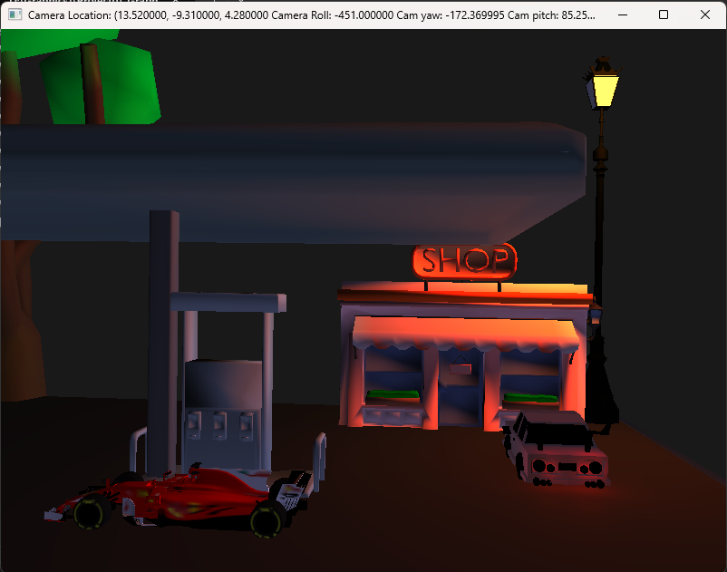

# OpenGL_Graphics_Project
This is a graphics project coded totally in C++ using OpenGL, GLAD, GLFW and in my own custom game engine! Screenshots at bottom of this Readme

## Name: Onkar Parag Kulkarni 

## Student ID: 1286580

Please read the build solution instructions at the end of README if you want to build and run the solution.

---

### Instructions To Use Scenefile:

1) Open the Scenefile in any text editor.

2) Specify number of meshes you want to load (In my case it is number_of_meshes 10, so if you want to load 15 meshes then it should look like this number_of_meshes 15).

3) after that paste the paths of meshes under the keyword: "mesh_paths" (Remember you don't have to change anything in path, you just have to paste it! Also number_of_meshes and the pasted paths should be equal!)

4) You can specifically mention the mesh transforms under the keyword: "mesh_transforms".

5) First 3 values are X, Y, Z locations of the model, then the next 3 values are the scales of the model on X, Y and Z axes, then the last 3 values are rotation values around X, Y and Z axes.

---

### Instructions To Use LightsFile:

1) Open the LightsFile in any text editor.

2) Specify the number of lights you want in scene after keyword: "number_of_lights"

3) After that specify the light properties after keyword: "light_properties"

4) First 3 values are X, Y, Z positions of light, next 4 are the R, G, B, A values of the light, next 4 are ambient values, next 4 are diffuse values, next 4 are specular values, where x, y, z of specular specify the light highlight and w specify the power, then next 4 are attenuation values, first one of them is constant, second is linear, 3rd is quadratic attenuation and 4rth is cutoff, after that next 4 values are direction values in which last w values is not defined yet, other 3 decide the direction of light, mainly used for directional and spot lights, then next 4 values are param1 where x is type of light(0 = POINT LIGHT, 1 = SPOT LIGHT, 2 = DIRECTIONAL_LIGHT), y value is inner cone angle and z is outer cone angle for spot light and w is not defined till now and next 4 values are param2 where x is 1 if you want to turn the light on and 0 for turning light off!

5) If you want to add one more light in here with those values you can simply add that light in here by specifying number of lights and properties and one more thing you need to do is open the solution file and go to line 168 of source.cpp and specify number of lights you want to turn on, if you have 10 lights and you specify to turn on 5 lights then it will turn on 5 lights from the first light.

---

### Camera Controls:

W: Travel Forward

A: Travel Left 

S: Travel Backward

D: Travel Right

SPACE: Travel Up

CTRL: Travel Down

Q: Roll Anticlockwise

E: Roll Clockwise

Mouse Movement in X will control Yaw

Mouse Movement in Y will control Pitch

---

### Changing Scenes: Key Callbacks

4: Shop and Car scene

5: F1 Car and Black Car scene

6: Street View

---

### Key Callbacks for Viewmode:

1: Point or Vertex Viewmode

2: Wireframe Viewmode

3: Fill Viewmode

---

### Instructions to Build:

1) Open the solution file

2) Right click on project in solution explorer

3) Then click build project.

4) Voila! You got it working!

---

### Thank you for using my project!
